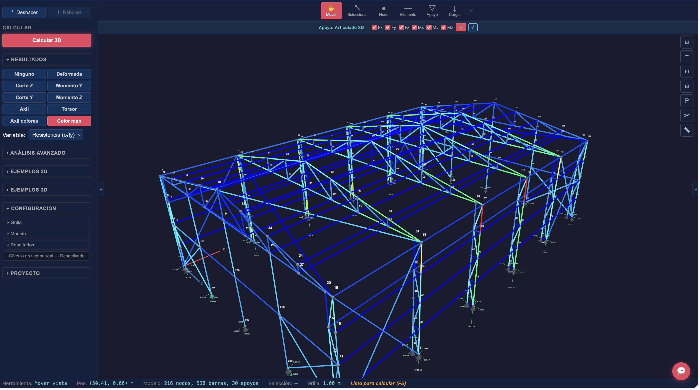
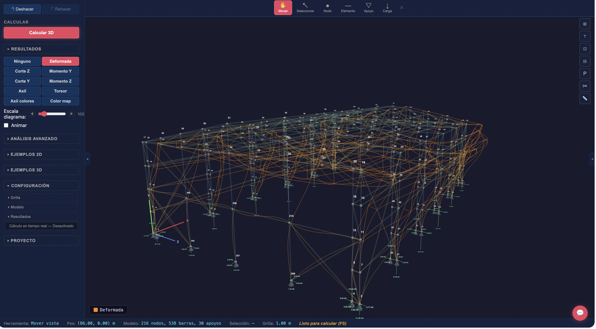

<p align="center">
  
</p>

<h1 align="center">Stabileo</h1>

<p align="center">
  <strong>Structural analysis, in a browser tab.</strong><br>
  A free and open structural-analysis platform. The solver is a Rust engine compiled to
  WebAssembly and it runs on your machine — no install, no licence key, no account.
</p>

<p align="center">
  <a href="https://stabileo.com">Open the editor</a> ·
  <a href="https://stabileo.com/en/blog">Blog</a> ·
  <a href="#what-works-today">What works today</a> ·
  <a href="#why-stabileo-exists">Why it exists</a> ·
  <a href="#features">Features</a> ·
  <a href="#getting-started">Getting started</a> ·
  <a href="docs/README.md">Docs</a>
</p>

<p align="center">
  <a href="LICENSE"></a>
  <a href="https://github.com/lambdaclass/stabileo/actions/workflows/ci.yml"></a>
</p>

<p align="center">
  
</p>
<p align="center"><sub>3D industrial warehouse with Pratt roof trusses and crane bridge. Orange overlay shows the deformed shape under load. 216 nodes, 538 elements, 30 supports.</sub></p>

<p align="center">
  
</p>
<p align="center"><sub>Same structure with stress utilization color map (σ/fy). Blue = lightly loaded, yellow = moderate, red = approaching yield.</sub></p>

---

## What works today

Stabileo ships three modes, and they are not equally finished. This is the same status the
site itself states, in the same words, because a README that promises more than the product
delivers costs more trust than the extra features would have bought.

| Mode | Status | What it is |
|------|--------|-----------|
| **Basic** | **Works today** | A practical workspace: 2D and 3D models, the essential tools of a university structures course, and results you can read, check and explain. |
| **PRO** | In development | Finite-element analysis and complex models already run here, at the level you would expect from a professional package. What is still being polished is design to the codes — the step many FE programs stop short of, handing you results and leaving the check to you. |
| **Education** | In development | A student-exercise layer on the same engine. Teachers write exercises in the app, hand them out as a link and get the answers back. What is missing is the layer above: the course. |

The [solver capabilities listed further down](#solver-capabilities) are **engine-level**. The engine implements more
than any one mode currently exposes, which is exactly why the modes are labelled the way they
are here.

The interface is available in **English, Spanish and Portuguese**.

---

## Why Stabileo exists

The dominant structural analysis tools — [SAP2000](https://www.csiamerica.com/products/sap2000),
[ETABS](https://www.csiamerica.com/products/etabs),
[Robot](https://www.autodesk.com/products/robot-structural-analysis),
[RFEM](https://www.dlubal.com/en/products/rfem-fea-software/what-is-rfem) — cost thousands of
dollars per year, run on Windows, require installation and licence servers, and are closed
source. Open-source solvers like [OpenSees](https://opensees.berkeley.edu/) are powerful but
require scripting and have no visual interface.

Stabileo is different:

- **Browser-native.** Open [stabileo.com](https://stabileo.com) and start. No download, no licence key, no account.
- **Real solver.** A Rust engine compiled to WebAssembly, running on your own machine — your models never leave it.
- **Real-time.** The solver runs on every edit. Move a node, change a load, resize a section, and the results follow.
- **It shows the development, not only the answer.** Kinematic analysis, section analysis and the step-by-step Direct Stiffness wizard explain *why* a result is what it is — including when the formula you were taught does not apply. See [the note on that](https://stabileo.com/en/blog/conceptual-side-advanced-tools).
- **Structured model surface.** The browser UI, the APIs and the AI workflows all target the same model/snapshot contract instead of hidden prompt magic.
- **AI-ready, but deterministic.** AI can generate, edit, review and explain models; the solver stays the source of truth for the mechanics.
- **Open source.** Read the solver, trace the maths, send improvements.

**Tech stack:** Svelte 5 front end, Rust solver engine via WASM, Three.js for 3D.

Originally built for structural engineering courses at [FIUBA](http://www.fi.uba.ar/)
(University of Buenos Aires).

---

## Humans and AI use the same solver

Stabileo's strongest technical wedge is not "AI chat" by itself. It is a `structured structural
model` and a `deterministic solver` that humans and AI can both operate.

- Engineers model directly in the browser and inspect diagrams, stresses, reactions and diagnostics.
- AI workflows build or edit the same structured model snapshot, then hand it to the same solver for real analysis.
- Review and explanation tools sit on top of solver artefacts and diagnostics instead of inventing mechanics.

Start here:

- [Docs hub](docs/README.md)
- [Quick start](docs/QUICKSTART.md)
- [AI modeling workflow](docs/AI_MODELING_WORKFLOW.md)
- [Solver reference](docs/SOLVER_REFERENCE.md)

---

## Features

### Solver capabilities

- 2D and 3D linear static, second-order, buckling, modal, response spectrum, time history, harmonic response, and moving loads
- Corotational and material nonlinear analysis, plastic analysis, fiber beam-column elements
- Staged construction, prestress/post-tension, cable analysis, contact/gap behavior, nonlinear SSI
- Initial imperfections, residual stress, creep/shrinkage
- Multi-family shell stack: MITC4 (ANS + EAS-7), MITC9, SHB8-ANS solid-shell, curved shells
- Guyan and Craig-Bampton model reduction
- Sparse-first assembly and solve with AMD ordering, 22-234× speedups on shell models
- Load combinations, envelopes, section analysis, stress recovery, kinematic diagnostics

### Design codes

| Code | Scope |
|------|-------|
| AISC 360 | Steel |
| ACI 318 | Concrete |
| EN 1993-1-1 (EC3) | Steel |
| EN 1992-1-1 (EC2) | Concrete |
| CIRSOC 201 | Concrete |
| AISI S100 | Cold-formed steel |
| NDS | Timber |
| TMS 402 | Masonry |
| ASCE 7 / EN 1990 | Loads and combinations |

### Validation

Benchmarked against NAFEMS, ANSYS Verification Manual, Code_Aster, SAP2000, OpenSees, Robot,
STAAD.Pro, and textbook solutions. See [BENCHMARKS.md](docs/BENCHMARKS.md) for full coverage.

---

## The blog

[stabileo.com/blog](https://stabileo.com/en/blog) — longer pieces on how the solver works, what
the code checks actually verify, and the decisions behind them, in English, Spanish and
Portuguese. Every figure in them is produced by the engine before the prose is written, and
several posts embed the real editor on the model they describe.

- [The determinism boundary](https://stabileo.com/en/blog/the-determinism-boundary) — why an AI agent must not do the arithmetic
- [What free software computes, and what it never explains](https://stabileo.com/en/blog/conceptual-side-advanced-tools) — where the free tools stop
- [Flexural verification to CIRSOC 201](https://stabileo.com/en/blog/verificacion-flexion-cirsoc-201) — the steps that decide the outcome
- [Bredt or Saint-Venant](https://stabileo.com/en/blog/torsion-bredt-saint-venant) — which torsion theory applies, and what picking wrong costs

---

## Getting started

**Use it now.** Open [stabileo.com](https://stabileo.com). Works in any modern browser.

**Run locally:**

```bash
git clone https://github.com/lambdaclass/stabileo.git
cd stabileo/web
npm install
npm run dev       # http://localhost:4000
```

```bash
npm test           # run the web test suite
npm run build:only # production build -> web/dist/
```

Requires Node.js >= 18.

`npm run build` does the same build and then prerenders every public route, which it does
by driving the real page in headless Chromium — so it needs a browser installed first:

```bash
npx playwright install chromium
npm run build     # build + prerender, what CI and the deploy run
```

Nothing else in the workflow needs it: `npm run dev`, `npm test` and `build:only` do not
prerender.

---

## Documentation

| Document | Contents |
|----------|----------|
| [docs/README.md](docs/README.md) | Docs hub: quick start, AI workflow, solver reference, and roadmap entry points |
| [QUICKSTART.md](docs/QUICKSTART.md) | First model tutorial: build, solve, inspect, and share a 2D beam |
| [AI_MODELING_WORKFLOW.md](docs/AI_MODELING_WORKFLOW.md) | How AI build/review flows use the structured model + solver loop |
| [SOLVER_REFERENCE.md](docs/SOLVER_REFERENCE.md) | Coordinate conventions, model objects, outputs, and execution surfaces |
| [SOLVER_ROADMAP.md](docs/roadmap/SOLVER_ROADMAP.md) | Solver status, sequencing, performance, and validation |
| [PRODUCT_ROADMAP.md](docs/roadmap/PRODUCT_ROADMAP.md) | App, workflow, and market sequencing |
| [INFRASTRUCTURE_ROADMAP.md](docs/roadmap/INFRASTRUCTURE_ROADMAP.md) | Backend, deployment, auth, persistence, and operational sequencing |
| [AI_ROADMAP.md](docs/roadmap/AI_ROADMAP.md) | AI capability sequencing, safety rules, and prerequisites |
| [BENCHMARKS.md](docs/BENCHMARKS.md) | Validation coverage and benchmark status |
| [VERIFICATION.md](docs/VERIFICATION.md) | Testing philosophy, fuzzing, invariants |
| [POSITIONING.md](docs/POSITIONING.md) | Market framing and competitive strategy |
| [engine/README.md](engine/README.md) | Rust solver engine API and analysis types |
| [CHANGELOG.md](CHANGELOG.md) | Milestone updates |
| [docs/research/](docs/research/) | Shell-family research, competitor comparisons, numerical methods |

---

## Contributing

Pull requests are welcome. For major changes, open an issue first to discuss the approach.

## Security

To report a vulnerability, email security@lambdaclass.com.

## License

[AGPL-3.0](LICENSE)

---

## Built by

- **Bautista Chesta** — Civil Engineer (FIUBA), UX/UI and project management
- **Diego Kingston** — Ph.D. in Engineering (UBA), product–solver integration
- **Federico Carrone** — Founder of [Lambda Class](https://lambdaclass.com), solver lead

With contributions from mathematicians, physicists, computer engineers, and computer scientists
at [Lambda Class](https://lambdaclass.com).
